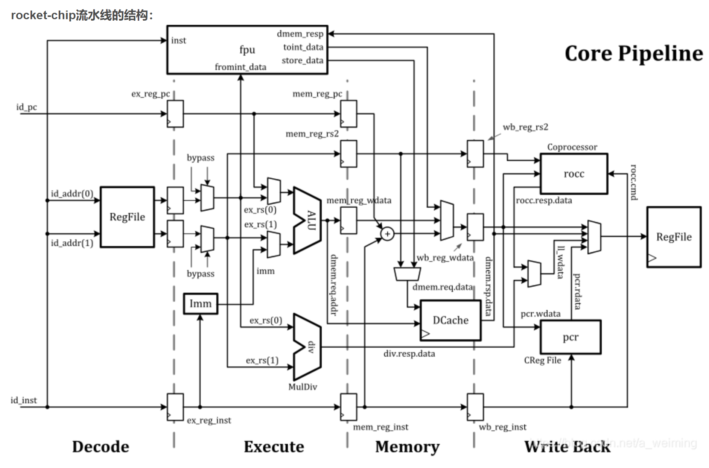

# BOOM

## Rocket-Core架构设计

rocket-core : rv64gc + mmu + bpu + float  + unblocked dcache + boot linux

rocket-core pipeline

rocket-core icache

rocket-core dcache

### Rocket Core Fetch

Frontend用于取指和预译码，

https://www.zhihu.com/column/c_1425551698199130112

[Rocket Core: Return Address Stack](https://www.jianshu.com/p/27f38bae827d)

[Rocket Core: 译码逻辑](https://www.jianshu.com/p/ec38c4ce56ce)

https://zhuanlan.zhihu.com/p/140360043

https://zhuanlan.zhihu.com/p/168755384

https://zhuanlan.zhihu.com/p/194075590

https://zhuanlan.zhihu.com/p/237232261

https://zhuanlan.zhihu.com/p/259271229

https://zhuanlan.zhihu.com/p/350301092

https://zhuanlan.zhihu.com/p/379874172

https://zhuanlan.zhihu.com/p/399543947

https://zhuanlan.zhihu.com/p/397105511

https://zhuanlan.zhihu.com/p/412828438

https://zhuanlan.zhihu.com/p/419866096
