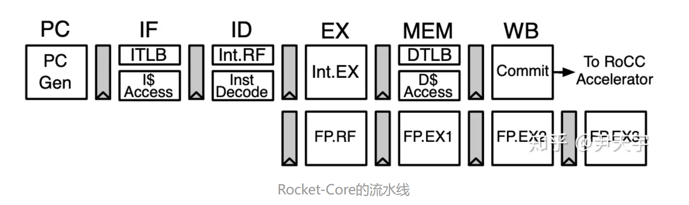
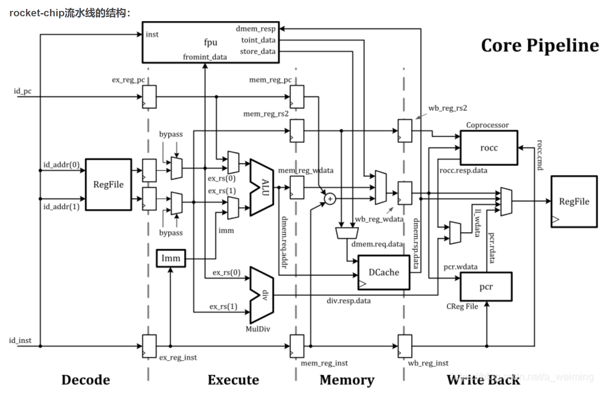
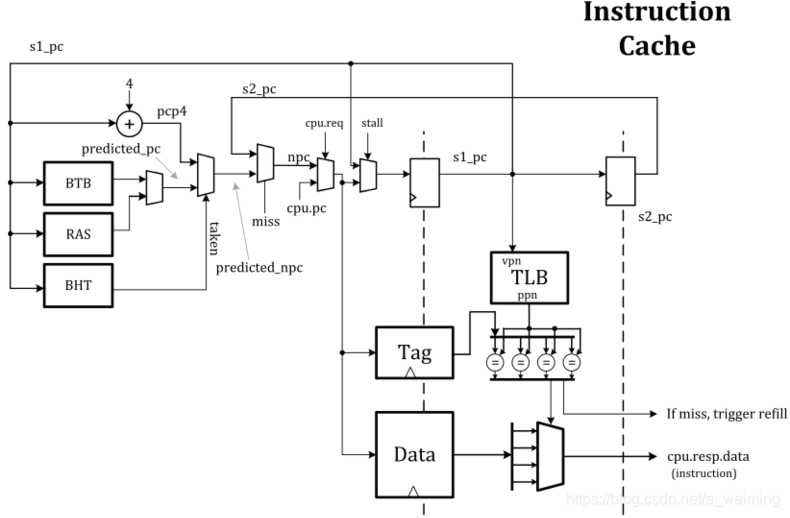
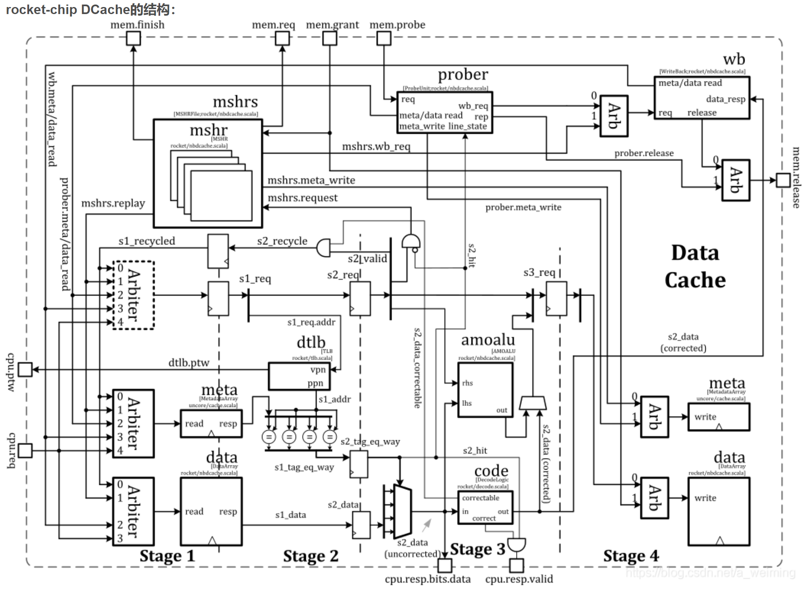
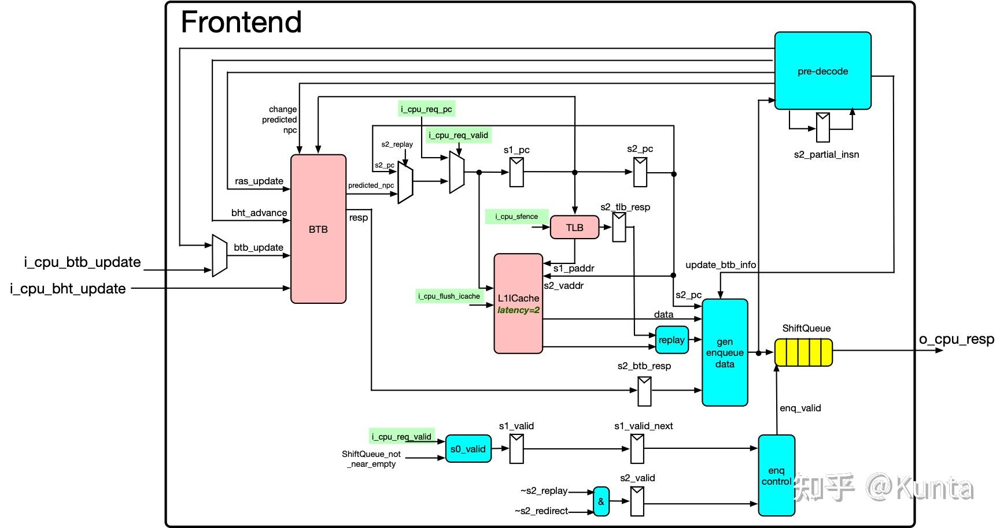

# Rocket-Core

## Rocket-Core架构设计

rocket-core : rv64gc + mmu + bpu + float  + unblocked dcache + boot linux

rocket-core pipeline

rocket-core icache

rocket-core dcache

### Rocket Core Fetch

Frontend用于取指和预译码，

[rocket-chip overview](https://www.cl.cam.ac.uk/~jrrk2/docs/untether-v0.2/overview/)

https://www.jianshu.com/p/f57cfada632f

https://www.zhihu.com/column/c_1425551698199130112

[Rocket Core: Return Address Stack](https://www.jianshu.com/p/27f38bae827d)

[Rocket Core: 译码逻辑](https://www.jianshu.com/p/ec38c4ce56ce)

[rocket汇总](https://www.cnblogs.com/wjcdx/tag/rocket/)

https://www.francisz.cn/2022/03/18/rocket-inclusive-cache/

[shili blog](https://shili2017.github.io/categories/%E5%86%85%E5%AD%98%E4%B8%80%E8%87%B4%E6%80%A7%E4%B8%8E%E7%BC%93%E5%AD%98%E4%B8%80%E8%87%B4%E6%80%A7/)

https://blog.csdn.net/weixin_42683993/article/details/89106876

https://blog.csdn.net/a_weiming/article/details/84594781

https://zhuanlan.zhihu.com/p/463498803
