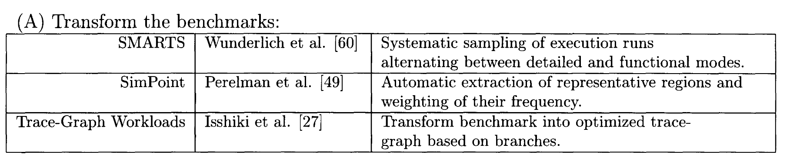

# HAsim

作者目前是NV架构师，2011年发表该博士毕业论文，论文本身是一个集大成者。实现了FPGA加速多核处理器的周期精确性能建模，并且是跨机构和跨公司的项目。

- Joel Emer提供了想法和指导；
- Intel VSSAD小组提供FPGA接口支持，scratchpad memory abstraction，LEAP-CORE虚拟平台基础架构设计
- 支持A-Ports formalism
- 使用Heracles进行对比实验
- bluespec提供编译器支持

## Introduction

### The Processor Simulation Problem

处理器的架构设计通常是基于直觉的，设计早期通过对架构的参数进行量化研究，反复实验，确定架构之后，才能够进入RTL步骤。设计早期的研究模型称为performance models, 该model能够为架构师提供从一个时钟周期到下一个时钟周期的动态行为的详细轨迹，但通常不能提供静态电路特性（如面积或时钟频率）。

performance model需要满足3个标准：

1. 足够准确
2. 足够灵活，方便探索各种性能提升的可能性
3. 建模的总时间足够短，为RTL和后端预留充分的时间

Performance model当前主要使用自研的软件仿真器或SystemC，但是仿真速度极慢，学术界仿真速度100kips，工业界更低，Intel基于Asim设计的performance model速度如下：

性能过低会限制benchmark运行的种类和长度，导致不能充分测试。为解决该问题（性能过低），提出了3种方法：

1. transform benchmark，只在benchmark动态执行的部分代表性样本中运行详细建模。

2. transform model，减少建模的细节，如果研究的现象不依赖于core的cycle by cycle的行为，就能够实现。但是如果说服主管，以及激进的设计思路，都需要相当的详细模型。

3. parallelize the model，并行运行模拟器，但是在处理多核时，仍然存在相当的差距。有如下原因：
   1. 模拟4核的工作量是模拟单核的4倍，但是在四核的主机上运行一个核需要考虑核间通信的开销，速度不可能有4倍。
   2. 如果在4核主机上模拟8核或16核，性能会更低
   3. 片上网络需要模拟更复杂的拓扑核路由结构，cache大小也在增加，需要运行更长时间的benchmark才能让机器得到充分运行（warmup?)

可以想到的解决方案是基于FPGA建模，FPGA加速硬件建模类似于显卡加速3D建模。分布式的逻辑仿真有数百个并行度，且并行任务非常小，相当于模拟几个gate。主流的FPGA加速器如下：

FPGA的优点是提高了模型的执行速度，但是设计过程比软件模拟器更复杂，FPGA需要使用硬件描述语言进行配置，存在的问题是：**模拟器开发占据大量的时间，抵消了执行时间的优势**。

HAsim的工作如下：

1. A-Ports，一种无需集中控制器即可在 FPGA 上进行分布式仿真控制的框架。
2. 一种在逐个模块的基础上对周期精确处理器模型进行细粒度时间复用的方案，包括通过排列复用片上网络的方案。
3. 通用功能分区方案的硬件实现。
4. 可重复使用的“即插即用”组件库，用于快速构建处理器模型。
5. 软连接抽象可提高硬件描述语言的模块化程度。

下图中的D代表了HAsim的工作，传统的FPGA方案使用ABC。A的tapeout指提交最终GDSII文件给Foundry 工厂做加工，B的Prototype指原型设计，在集成电路原型（Prototype）设计阶段，为了验证设计，必须进行工程流片，即把设计变成原型样片。而从原型样片到实用化的产品，还需要经过多次修改，优化设计，最终形成实用化产品。

### FPGAs as Architectural Simulators

继续看上图，A可以使用预先配置的FPGA代替定制的芯片，在该情况下，RTL设计时就考虑了FPGA，可以使用特定的FPGA资源如Xilinx的sync block RAM。

B代表的电路原型设计，FPGA在芯片制造前帮助验证，在该情况下，RTL设计时考虑了ASIC，包含适用于ASIC的电路结构如多端口寄存器，或者content-addressable memory，会导致FPGA配置效率低下。

C代表的功能仿真，不包含时序信息，不需要创建与ASIC相关的电路，效率较高。

D需要将系统的功能和预期的时序进行结合，但是这些时序可能会和FPGA substrace的时序相差很多，如果预期的RTL设计时面向ASIC，仍然会有效率低的可能。

另一个需要解决的问题是**The Model Clock Versus the FPGA Clock**，FPGA-accelerated simulator必须能够正确地对所有结构的时序建模，且不必通过直接将 FPGA 配置到这些结构中来实现这一点。下图中，希望模拟的架构是2r2w的regfile，即Target A，当地址被assert时，读到的value出现在相同的target cycle，外部逻辑确保对同一个地址的两次写入从不会在同一模型的时钟周期上被断言。直接配置FPGA到这种结构会导致空间效率低下，因为无法直接使用内置的block RAM，并且与建议的regfile有不同的时序特性，直接使用FPGA仿真将会使用单独的寄存器和多路复用器来进行组合，代价比较大。

基于FPGA的simulator考研将FPGA clock和simulator model clock分开，该simulator可以使用block RAM和FSM配合来模拟目标行为。使用计数器跟踪模拟的target cycle，FSM确保cycle counter执行两次读写和两次写入之前不会递增。该方案可以设计一个高频且面积小的simulator，但是需要花费3 fpga cycle来模拟一个model cycle。

需要考虑的另一个问题是**Space-Time Tradeoffs in FPGA Modeling**，将model clock和FPGA clock分开，使得架构师能够用时间换面积，代价是使用额外的FPGA周期。CAM如果直接在FPGA上面实现，会存在面积大且关键路径长的问题，但是可以用单端口block RAM进行模拟，FSM会依次搜索RAM，在搜索完成之前，model clock cycle不会递增，从而实现并行CAM的模拟。

FPGA也可以被插入到包含大量host memory的host platform中，将model clock和fpga clock分离允许模拟器利用该内存，即使size和latency可能与所模拟的完全不同。下图中，模拟器在具有三级内存的平台上运行，fpga上的block ram，板载SRAM和被运行在主机处理器上的os所管理的DRAM。simulator希望使用该层次结构模拟5MB的最后一级cache，通过在block ram， sram和dram中分配空间来实现，通过使用3个cache代替单个大型cache。fpga首先检查block ram是否命中，如果不命中会接着访问sram或者dram。

如果目标电路在fpga上直接实现效率低下，为fpga编写性能模型的设计者可以有如下方案：

1. 选用快速但昂贵的电路
2. 空间换时间
3. 减少面积但增大周期数
4. 使用多个FPGA进行模拟

HAsim的工作在于开发了一些列用于推理fpga性能模型的指标，帮助架构师做出相关的选择。下面将介绍相关的指标：

FPGA-cycles-to-Model-cycles Ratio (FMR): 
$$
FMR = cycles_{FPGA}/cycles_{model}
$$
上面提到的案例中，使用3个fpga cycle来模拟一个model cycle，FMR = 3。可以检查单个model cycle，一个region或者一次运行的FMR，与CPI的概念类似，可以考虑特定指令或者操作类型的FMR，从而获取性能瓶颈，在考虑模型的潜在改进价值时，FMR相当有用。

注意：如果整体的时钟周期降低太多，用于FMR的改进毫无用处，模拟器的总速度必须考虑FPGA配置可以达到的频率：
$$
frequency_{simulator} = frequency_{FPGA}/FMR_{overall}
$$
实践中发现，cycles per second不是衡量fpga performance model性能的最佳指标，因为相比heavy activity，pipeline bubbles通常需要更少的cycle来模拟，这些idle cycles会降低FMR并提高频率，更好的指标是使用Instructions Per Second (IPS)
$$
IPS_{simulator} = frequency_{simulator}/CPI_{model}
$$
上面的公式结合一下：
$$
IPS_{simulator} = frequency_{FPGA}/(CPI_{model} * FMR_{overall})
$$
下面需要讨论的是**Logic Emulation and FPGA/Model Cycle Separation**，如果使用多个FPGA仿真电路网表，FPGA之间的通信需要多个FPGA cycle，逻辑仿真器开发了同步机制，每个FPGA单独执行逻辑仿真，停止FPGA时钟，然后在各个FPGA之间执行同步，再继续逻辑仿真，行业标准是SCE-MI接口。

上述的设计中，离开fpga的物理引脚是宝贵的资源，虚拟wire是将模型中的多条导线复用到单个物理引脚上，从而提高每个物理引脚的利用率。fpga执行逻辑仿真步骤，在执行多路复用通信时停止，再恢复逻辑仿真。进一步，可以拓展到TIERS调度算法，允许跨多个fpga进行逻辑仿真的智能调度，通过流水线降低FMR。

传统的逻辑仿真技术将fpga cycle和model cycle分离，逻辑仿真自身需要fpga的单个时钟周期，不同的逻辑仿真步骤之间的协调需要多个fpga周期。 作者的改进将协调所需的额外周期数取消，且工作仅限于单个fpga。

接着讨论**FPGA Models and Target Circuit Characteristics**，fpga performance model和软件模拟器有相同的限制，无法深入了解目标设计的物理特性，因为RTL针对fpga进行了很多调整。

### Related Contemporary Approaches

2011年左右，fpga仿真加速兴起，有下面几个因素：

1. fpga性能，容量提高
2. 出现了新型产品，允许通过pcie，Intel frong side bus将fpga添加到host computer，fpga从独立系统转变为通用加速器。
3. 模拟多核越来越困难，使得simulator架构师探索fpga用于原型设计之外的功能

其中的RAMP项目比较突出，主要用于探索使用fpga加速体系结构研究，RAMP汇聚了各个大型的合作者，项目如下：

早期成果是**ramp blud**，由多个BEE2电路组成，每个电路包含多个fpga，比当时的软件仿真快几个数量级。

**ramp red** (ATLAS)使用BEE2实现transactional memory multicore，ATLAS上执行代码的速度比软件仿真快几个数量级，但是限制是网络通信的时序收到BEE2和powerPC处理器的物理制约。

**Bheehive**在fpga上实现了都和且采用Xilinx平台

此外还实现了**RDL**（ramp description language)，用于解决fpga开发时间问题和仿真协调问题。RDL与A-Ports类似，但也有不同，A-Ports还没看，先略。

**Protoflex**用于加速SMARTS-style模拟，该模式中，详细的时序模型进允许在大型benchmark的一个小型采样中，其余的允许部分，使用功能准备的仿真器替代。Protoflex的贡献如下：

1. 实现了fpga与主机cpu之间的仿真迁移，实验中发现有一类指令非常罕见，但是在fpga上实现代价高昂（开发量+面积），采用的方案是检测是否存在，并且将仿真状态迁移到CPU，使用软件进行仿真再将结果传到fpga，迁移速度很快，但是如果该类指令足够少，影响也能接受。
2. 实现了时分复用，protoflex在处理迁移事件时，physical pipeline处于idle，可以用于执行其他现场

HAsim的改进是更加细粒度的多路复用，实现cycle-by-cycle的连续建模

代价太大，已经胎死腹中
