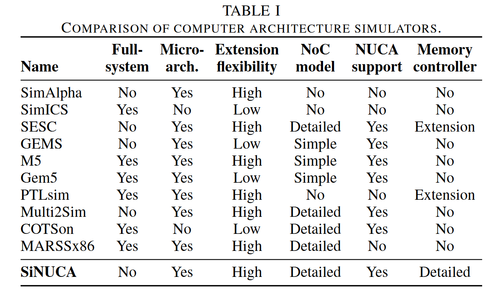
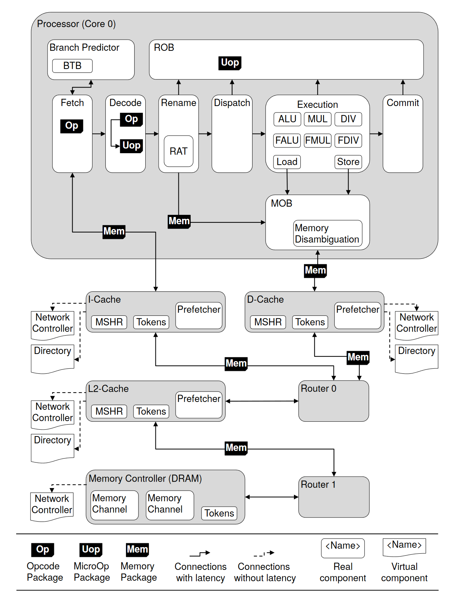

# SiNUCA: A Validated Micro-Architecture Simulator

特点：cycle accurate, trace driven, 针对不同硬件组件独立测试benchmark

解决的问题如下

1. 复杂性：CMP SMP bpu ,memory  disambiguation prediction, non-uniform cache architecture, noc

2. 通用模拟器在内存模型上误差率最大
3. os simulation会在评估过程中引入噪声
4. 部分模拟器仅对inter latency建模，对于流量争用没有考虑
5. dram controller固定延迟，不准确

## The SiNUCA Simulator

架构设计如下：按照package进行划分，比较值得学习的是router,对互联造成的争用和延迟建模

